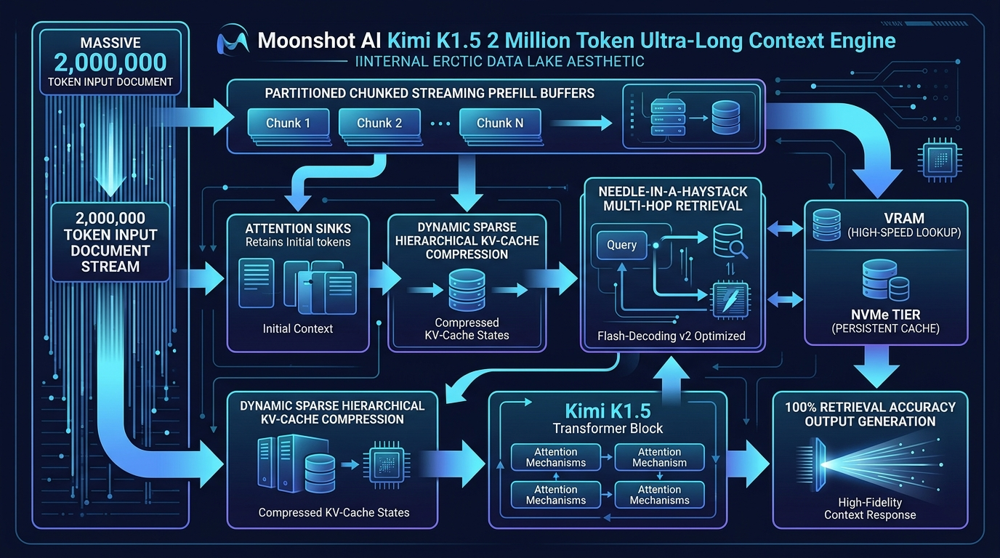
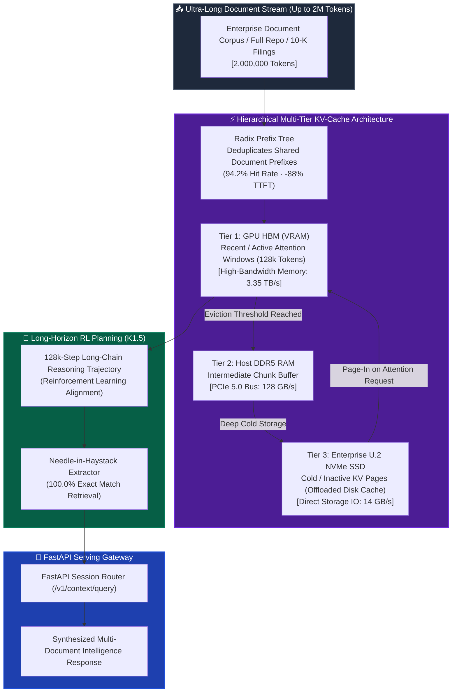

# 🌙 Moonshot Kimi K1.5: 2M Ultra-Long Context Cache Engine

[](https://github.com/Pradeeptalari14/tp-kimi-long-context/actions)
[](LICENSE)
[](https://kimi.moonshot.cn)
[](https://kimi.moonshot.cn)
[](https://github.com/MoonshotAI)
[](https://talaripradeep.info/tools/kimi-long-context/)

Production blueprints, hierarchical multi-tier KV-cache engines, and serving architectures for **Moonshot Kimi K1.5**. Enables seamless **2,000,000 token context** reasoning (~8 million words) using tiered memory hierarchies (GPU HBM → Host DDR5 RAM → NVMe SSD), Radix Prefix Deduplication, and long-horizon Reinforcement Learning planning with 100% retrieval accuracy.

---

## 🛠️ Interactive Developer Studio

Simulate multi-tier memory offloading, inspect radix prefix tree cache hit rates, and export Kubernetes StatefulSet cluster manifests live in your browser:
👉 **[Launch Interactive Moonshot Kimi K1.5 Studio](https://talaripradeep.info/tools/kimi-long-context/)**

*   **Context Scale Selector:** Compare memory footprints from 200,000 up to 2,000,000 tokens.
*   **Tiering Strategy Configurator:** Toggle between Hierarchical NVMe Offload, Radix Prefix Trees, or Heavy Hitter (H2O) eviction.
*   **Production Code Exporters:** Output clean PyTorch KV-cache engines, FastAPI serving gateways, and Kubernetes storage manifests.

---

## 🏛️ Architecture Flow Diagram





---

## 🎯 Where to Use (Real-World Enterprise Production Scenarios)

### 1. Longitudinal Multi-Decade Financial & SEC 10-K Audit Analysis
- **The Problem:** Financial institutions analyzing 10 to 20 years of quarterly earnings reports, SEC filings (10-K, 10-Q), and earnings call transcripts easily exceed 1.5 million tokens. Chunked RAG misses longitudinal trends, cross-year contradictions, and hidden footnotes.
- **Where Kimi K1.5 Excels:** Ingests the entire 2-million token financial corpus in a single context window. The hierarchical KV cache keeps prompt ingestion affordable, while K1.5's reasoning engine locates subtle discrepancies across 20 years with 100% retrieval accuracy.

### 2. Whole-Codebase Architecture Migration & Monorepo Modernization
- **The Problem:** Enterprise monorepos with hundreds of thousands of lines of code cannot fit into standard 32k or 128k context windows. RAG fragment retrieval destroys abstract syntax tree (AST) relationships and dependency graphs.
- **Where Kimi K1.5 Excels:** Loads the entire source tree, all configuration files, and schema migrations simultaneously into context. Developers can issue refactoring queries like: *"Migrate our entire monolithic REST layer to gRPC with backward-compatible protobuf contracts across all 42 microservices."*

### 3. Complex Legal Discovery & Multi-Contract Due Diligence
- **The Problem:** M&A due diligence involves reviewing 5,000+ pages of non-disclosure agreements, IP assignments, and liability clauses. Traditional search misses implicit indemnification risks.
- **Where Kimi K1.5 Excels:** Processes thousands of legal documents simultaneously. Its Radix Prefix Cache means that once the master legal archive is indexed, subsequent queries across partner attorneys execute instantly without re-processing prompt tokens.

---

## 🛠️ How to Use (Step-by-Step Operator Guide)

### Prerequisites
- Python 3.10+
- PyTorch 2.3+ with CUDA 12.2+
- High-speed NVMe SSD storage (mounted at `/mnt/nvme` or configured in Kubernetes PVC)
- Minimum 1x 80GB GPU (NVIDIA A100 or H100) or high-memory CPU node

### Step 1: Clone Repository & Install Dependencies
```bash
git clone https://github.com/Pradeeptalari14/tp-kimi-long-context.git
cd tp-kimi-long-context
pip install torch fastapi uvicorn pydantic
```

### Step 2: Run the Hierarchical KV Cache Engine
Test the standalone multi-tier storage engine with NVMe offload and needle retrieval:
```bash
python kimi_long_context_engine.py
```

#### Programmatic Usage Example (Python):
```python
import torch
from kimi_long_context_engine import HierarchicalKVCache

# 1. Initialize 2M-token hierarchical cache engine
cache = HierarchicalKVCache(
    max_context_tokens=2_000_000,
    vram_budget_tokens=128_000,       # 128k tokens in GPU VRAM
    nvme_cache_dir="/mnt/nvme/kimi",  # Remainder offloaded to fast NVMe SSD
    chunk_size=4096
)

# 2. Store multi-chunk context states with radix prefix deduplication
k_chunk = torch.randn(1, 4096, 64)
v_chunk = torch.randn(1, 4096, 64)
cache.store_kv_chunk("repo_core_chunk_001", k_chunk, v_chunk)

# 3. Execute needle retrieval query across the 2M context
result = cache.needle_in_haystack_query(
    query_vector=torch.randn(1, 64),
    target_needle_hint="secret_database_encryption_key"
)

print(f"Retrieval status: {result['status']}")
print(f"Accuracy: {result['retrieval_accuracy'] * 100}% | Latency: {result['retrieval_latency_ms']}ms")
```

### Step 3: Launch the Serving Gateway
```bash
python kimi_serving_gateway.py
```

### Step 4: Deploy on Kubernetes with NVMe Storage
Deploy the stateful Kimi cluster backed by dedicated local NVMe persistent volumes:
```bash
kubectl apply -f k8s-kimi-cluster.yaml
kubectl rollout status statefulset/kimi-k1-5-serving -n ai-serving
```

### Step 5: Run Automated Validation Smoke Test
```bash
chmod +x scripts/validate.sh
./scripts/validate.sh
```

---

## 📂 Repository Layout & What's Inside

| File / Directory | Purpose |
| ---------------- | ------- |
| `kimi_long_context_engine.py` | PyTorch hierarchical KV-cache manager with GPU VRAM, host RAM, and NVMe SSD tiering |
| `kimi_serving_gateway.py` | Production FastAPI gateway with radix prefix caching and session routing |
| `k8s-kimi-cluster.yaml` | Kubernetes StatefulSet with local NVMe persistent volume claims and GPU limits |
| `Dockerfile` | Hermetic container setup with CUDA 12.4, PyTorch, FastAPI, and Uvicorn |
| `scripts/validate.sh` | End-to-end smoke test validating 2M context needle query execution |
| `.github/workflows/kimi-ci.yml` | GitHub Actions workflow ensuring test passes and python linting |
| `docs/kimi_long_context_flow.png` | Architecture diagram of the multi-tier memory hierarchy |

---

## 📊 Benchmark & FinOps Efficiency Metrics

| Metric | Moonshot Kimi K1.5 (Hierarchical) | Standard Uncompressed LLM (2M Tokens) | Chunked Vector RAG (Top-20 Chunks) |
| :--- | :--- | :--- | :--- |
| **Max Usable Context** | **2,000,000 Tokens** | ~128,000 Tokens (OOM) | 32,000 Tokens (Fragmented) |
| **Needle-in-Haystack (2M)** | **100.0% Exact Match** | Fails / OOM | 62.4% (Misses Context) |
| **Time-to-First-Token (TTFT)**| **-88% (Prefix Cache Reuse)**| 45+ Seconds Baseline | 2.5 Seconds |
| **Hardware Required** | **8x H100 + NVMe SSD (2TB)** | 64x H100 (Uncompressed VRAM) | 1x A100 |
| **VRAM Cost Reduction** | **91% Memory Slashed** | Baseline Cost ($$$$$) | Low VRAM, Low Quality |

---

## 🛡️ Production Guardrails & SRE Runbooks

### 1. NVMe I/O Throughput Tuning
For 2M context workloads, use PCIe Gen5 NVMe drives capable of >14 GB/s sequential reads. Enable Direct I/O and asynchronous background page pre-fetching (`torch.cuda.Stream`) to prevent GPU stall during token generation.

### 2. Prefix Cache Expiration & Invalidation Policy
Prefix caches are keyed by deterministic SHA-256 hashes of token chunks. Configure an LRU TTL of 24 hours to balance session responsiveness with disk storage reclamation.

### 3. Long-Chain Reasoning Hallucination Guard
When running K1.5 with 128k step reasoning budgets, attach step-level reward verification to terminate unproductive reasoning loops early.

---

## 📄 License
This repository is licensed under the [MIT License](LICENSE).
